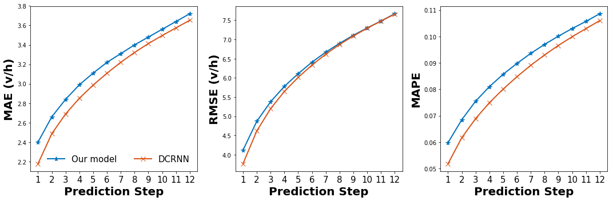
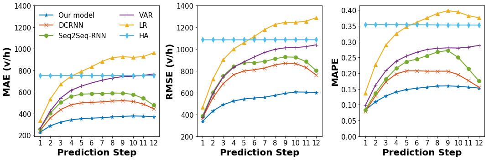
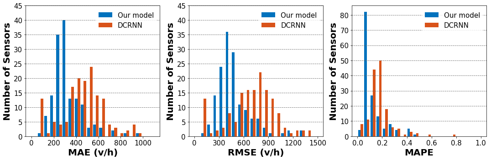
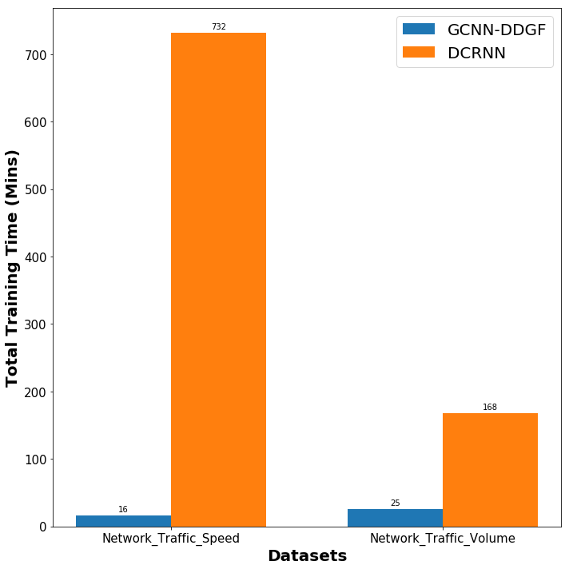
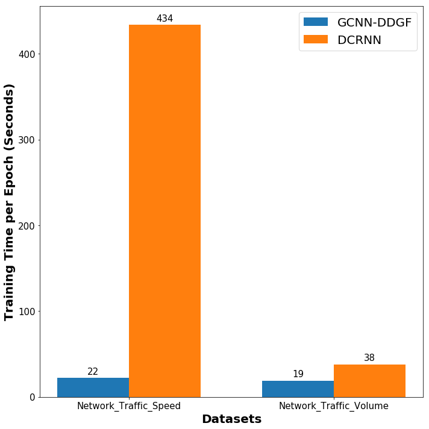

## Graph Convolutional Gated Recurrent Neural Network (GCGRNN)
### Improved from Graph Convolutional Neural Networks with Data-driven Graph Filter (GCNN-DDGF)

This repository includes GCGRNN and GCNN-DDGF work for the following challenges:

* Network-wide Station-level Bike-Sharing Demand Prediction
* Network-wide Traffic Speed Prediction
* Network-wide Traffic Volume Prediction

### Bike-Sharing Demand Prediction (GCNN-DDGF)

The Bike-sharing demand dataset includes over 28 million bike-sharing transactions between 07/01/2013 and 06/30/2016, which are downloaded from [Citi BSS in New York City](https://www.citibikenyc.com/system-data). The data is processed as follows: 

* For each station, 26304 hourly bike demands are aggregrated based on the bike check-out time and start station in trasaction records;

* New stations were being set up from 2013 to 2016. Only stations existing in all three years are included;

* Stations with total three-year demand of less than 26304 (less than one bike per hour) are excluded. 

After preprocessing, 272 stations are considered in this study. The 272 by 26304 matrix is saved as [NYCBikeHourly272.pickle](https://github.com/transpaper/GCNN/tree/master/data/NYC_Citi_bike). The Lat/Lon coordinates of 272 stations are saved in [citi_bike_station_locations.csv](https://github.com/transpaper/GCNN/tree/master/data/NYC_Citi_bike).

### Network-wide Traffic Speed Prediction (GCGRNN)

We are using the traffic speed data from Los Angeles ([metr-la.h5](https://github.com/transpaper/GCNN/tree/master/data/METR-LA_traffic_speed)) provided in the following paper:

* Yaguang Li, Rose Yu, Cyrus Shahabi, Yan Liu, ["Diffusion Convolutional Recurrent Neural Network: Data-Driven Traffic Forecasting"](https://github.com/liyaguang/DCRNN), ICLR 2018. 

The current best performance is **3.19** (Mean Absolute Error) for a 12-step prediction. The comparison of our GCNN-DDGF and DCRNN is shown as follows:


<p float="left">
  
</p>

### Network-wide hourly Traffic Volume Prediction (GCGRNN)

We download a real-world network-wide hourly traffic volume dataset from [the PeMS system District 7 (01/01/2018-06/30/2019)](http://pems.dot.ca.gov/). The dataset ([sensor_volume_150.csv](https://github.com/transpaper/GCGRNN/tree/master/data/METR-LA_traffic_volume)) includes 150 sensors, each sensor has 13,104 hourly traffic volumes. The dowloading and preprocessing can be found [here](https://github.com/transpaper/GCGRNN/blob/master/Download_and_Process_PEMS_traffic_volume_data.ipynb).

The whole dataset is split into training, validation, and testing datset according to a rate of 0.7, 0.1, and 0.2. The comparison of GCGRNN and DCRNN for a 12-step prediction is also shown as below:

<p float="left">
  
</p>

We also compare the spatial prediction performance of GCGRNN and DCRNN:

<p float="left">
  
</p>

### Network-wide 15-minute Traffic Volume Prediction (GCGRNN)
We download a real-world network-wide 15-minute traffic volume dataset from [the PeMS system District 7 (01/01/2019-06/30/2019)](http://pems.dot.ca.gov/). The dataset ([sensor_volume_150.csv](https://github.com/transpaper/GCGRNN/tree/master/data/METR-LA_traffic_volume)) includes 150 sensors, each sensor has 17,376 15-minute traffic volumes. 

The whole dataset is split into training, validation, and testing datset according to a rate of 0.7, 0.1, and 0.2. The comparison of GCGRNN and DCRNN for a 12-step prediction is also shown as below:

<p float="left">
  
</p>

### Training Time Comparison

We find that GCNN-DDGF can be trained much faster than DCRNN at a single GTX 1080 Ti machine. The training configuration files can be found [here](https://github.com/transpaper/GCNN/tree/master/GCGRNN_speed_volume/model_config).

<p float="left">


</p>

### Citation
You are more than welcome to cite our paper:
```
@article{lin2018predicting,
  title={Predicting station-level hourly demand in a large-scale bike-sharing network: A graph convolutional neural network approach},
  author={Lin, Lei and He, Zhengbing and Peeta, Srinivas},
  journal={Transportation Research Part C: Emerging Technologies},
  volume={97},
  pages={258--276},
  year={2018},
  publisher={Elsevier}
}

```
